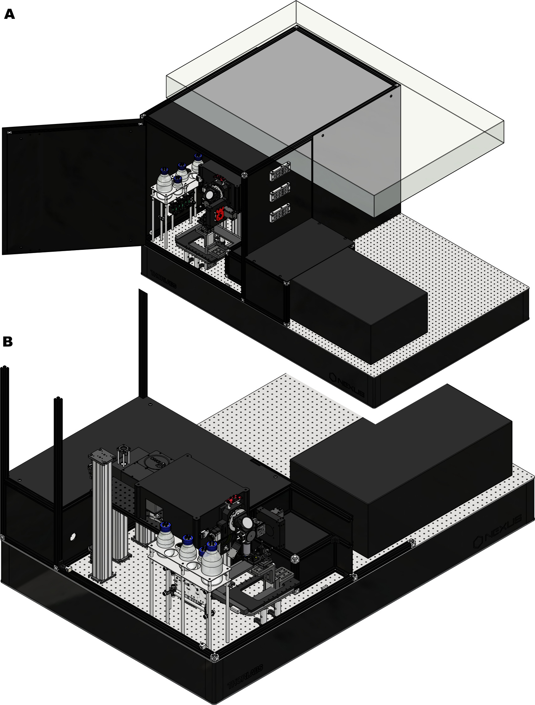
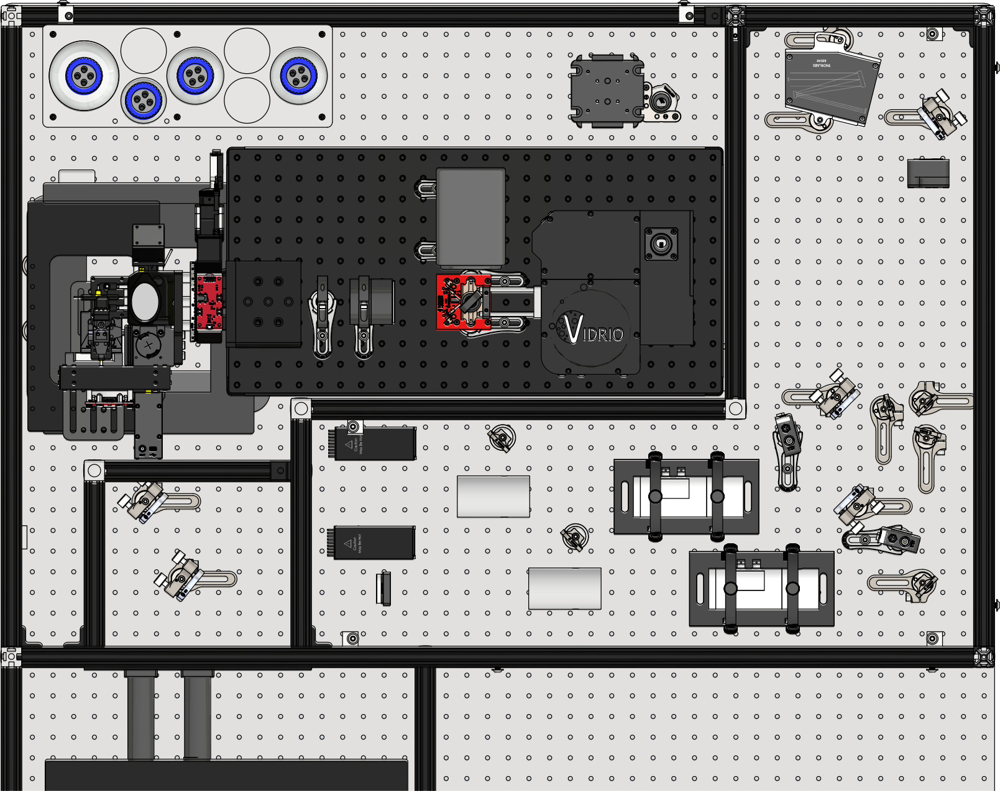
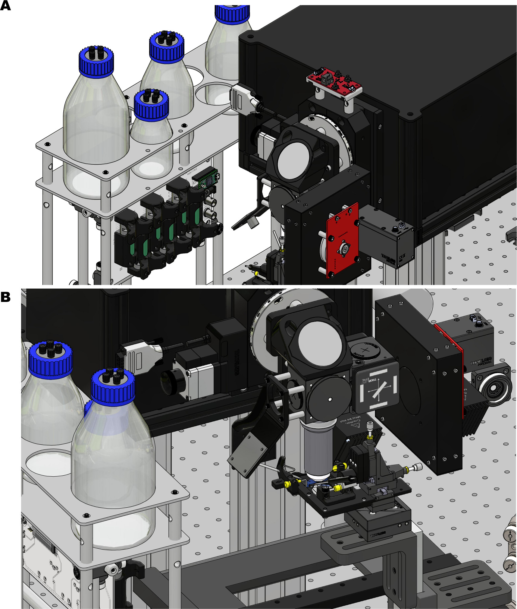
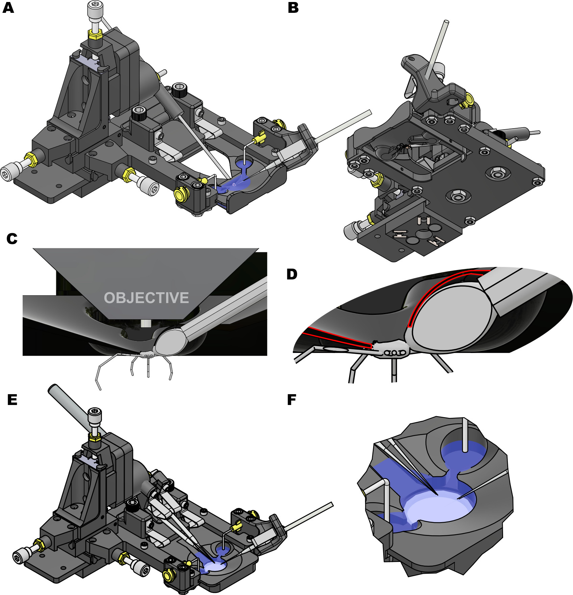

### A. Corver, A. Gordus (2023) A custom, flexible two-photon microscope tailored to imaging in the spider U. diversus

This repository contains design files for a custom two-photon microscope tailored to imaging in the spider _U. diversus_. It possesses 360-degree objective, a PMT filter wheel and a perfusion system.

##### Overview

##### Optics

##### Collection optics & sample stage

##### Holder design

